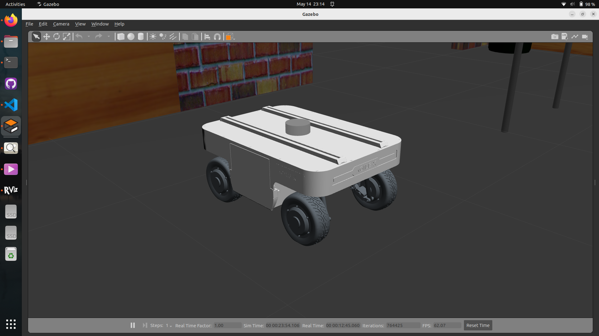
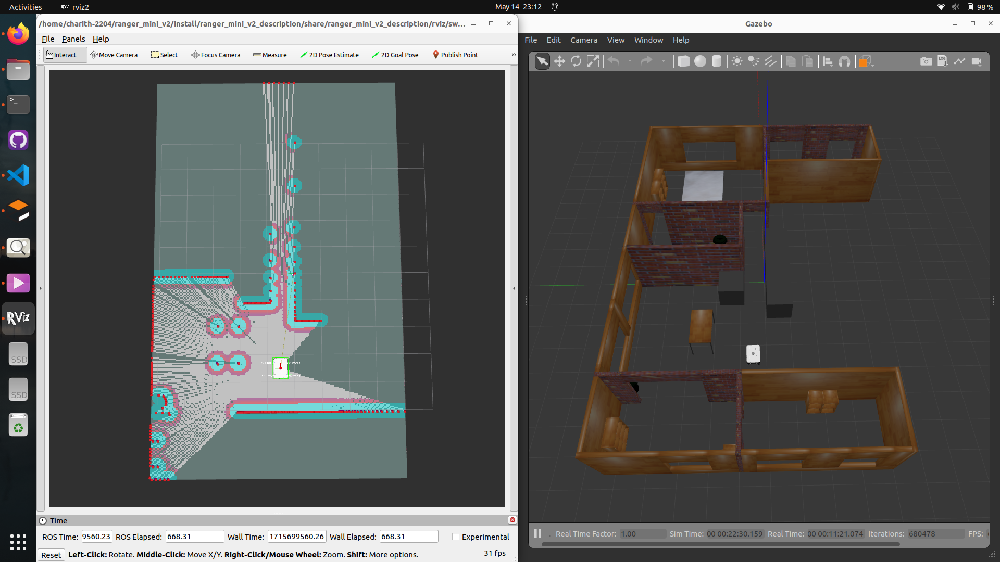
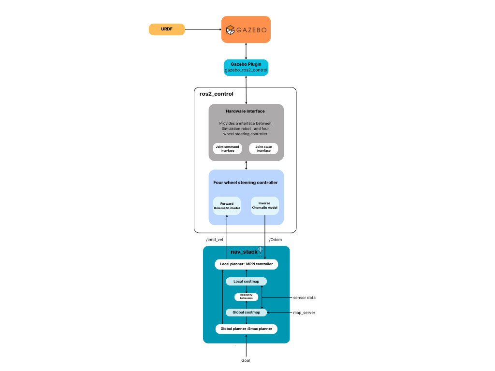
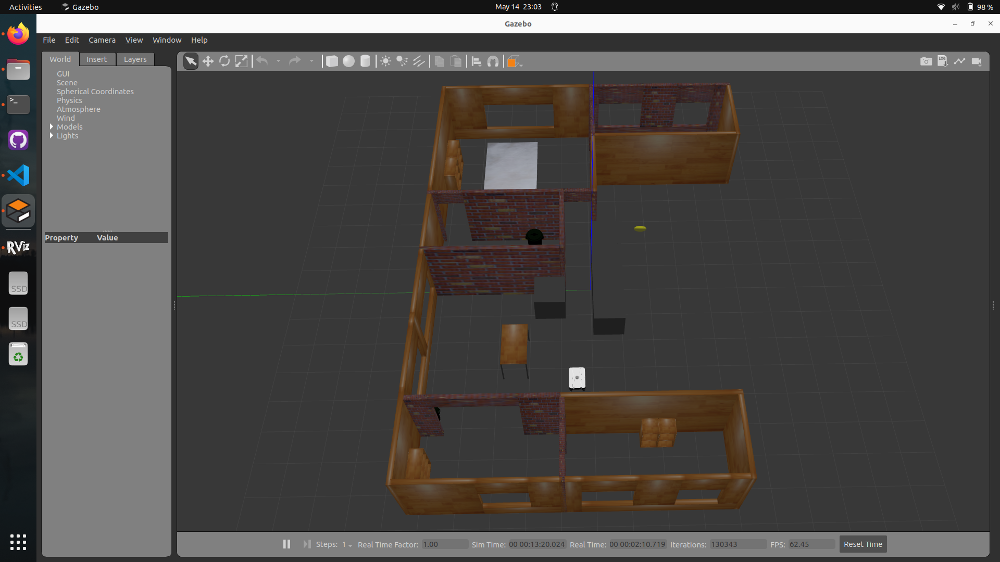

# OVERVIEW
<p align="justify">
This is a ROS2 simulation of a swerve drive robot named ranger_mini_v2. This workspace is a partial migration from the ROS1 simulation by Weston Robot. Specifically, the four_wheel_steering_controller package, ranger_mini_v2_navigation package, and ranger_mini_v2_description package have been significantly modified. Although the urdf_geometry_parser package is not being used here.
</p>

# Prerequisites

- Ubuntu 22.04 OS
- ROS2.0 Humble environment

# Follow below steps to set-up your workspace

<p align="justify">
All packages in this repository have been developed, executed and tested in an Ubuntu 22.04 machine with ROS2.0 Humble. Please set-up a ROS2.0 Humble environment in Ubuntu 22.04 and then follow the below steps to set-up your workspace.
</p>

1. Go inside your workspace (where your downloaded src file is located).

   Example: 

        home
          └── ranger_mini_v2
          ├──    └── src
          .
          .
          └── 
      In terminal,

       cd ranger_mini_v2

2. Build packages - run this command in your terminal
        
       colcon build --symlink-install
       

3. Open three terminals, In each terminal run following commands one by one in order to start the simulation.

   - To spawn the robot and the controllers into gazebo environment.

         ros2 launch ranger_mini_v2_gazebo gazebo.launch.py use_sim_time:=true

   - To start simultanious mapping and localization. 
   
         ros2 launch ranger_mini_v2_navigation slam.launch.py use_sim_time:=true

   - To navigate the robot using rviz2.
   
   
         ros2 launch ranger_mini_v2_navigation nav2.launch.py use_sim_time:=true


After that you can able to see gazebo and rviz2 windows like this.







[Simulation video-1](https://drive.google.com/file/d/1kGQDAgb77I5bMFVlKN86udLNigSDjU7L/view?usp=sharing)

[Simulation video-2](https://drive.google.com/file/d/1DRm593709AjEyMUHWVXXF5L8cFRlZKf_/view?usp=sharing)

# Architecture



# List of Packages

- ranger_mini_v2_description

- ranger_mini_v2_gazebo

- ranger_mini_v2_control

- ranger_mini_v2_navigation

- four_wheel_steering_controller


# Package-wise guide

### ranger_mini_v2_description package

      ranger_mini_v2_description
            ├── CMakeLists.txt
            ├── LICENSE 
            ├── package.xml
            ├── meshes
            │   └── components
            │       ├── base_link.STL
            │       ├── base_texture.png    
            |       ├── wheel_assembly_a.dae
            |       ├── wheel_assembly_b.dae
            │       └── wheel_texture.png
            ├── rviz
            |   └── swerve.rviz
            └── urdf
                ├── ranger_mini_v2.urdf
                └── include
                    └── ranger_mini_v2
                        ├── components.urdf
                        ├── lidar.urdf   
                        └── ros2_control.urdf

- **CMakeLists.txt** - This file contains the CMake configuration, which is used to build and compile the package.

- **LICENSE** - This file contains the licensing information for the package.

- **package.xml** - This file contains the package metadata for ROS, such as the package name, version, description, dependencies, etc.

* **meshes/components** - This folder contains the 3D models and textures used to visually represent the robot.

  - **base_link.STL** - A 3D model file in STL format representing the base link of the robot.

  - **base_texture.png** - A texture image used to apply visual color to the base link of the robot.

  - **wheel_assembly_a.dae** - A 3D model file in DAE format for the first type of wheel assembly.

  - **wheel_assembly_b.dae** - A 3D model file in DAE format for the second type of wheel assembly.

  - **wheel_texture.png** - A texture image used to apply visual color to the wheels of the robot.


* **rviz** - This folder contains configuration files for visualizing the robot in RViz, a 3D visualization tool for ROS2.

  - **swerve.rviz**  - A configuration file for RViz specifying how to display the visualization of maps, robot model, Laserscan, Path etc


* **urdf** - This folder contains the Unified Robot Description Format (URDF) files that define the physical and visual properties of the robot.

  - **ranger_mini_v2.urdf** - The main URDF file that brings together all components (defined in components.urdf) and configurations to define the complete Ranger Mini V2 robot model.

  - **include/ranger_mini_v2** - This subfolder contains additional URDF files that define specific parts or functionalities of the robot.

      - **components.urdf** - A URDF file defining individual components of the robot.

      - **lidar.urdf** - A URDF file specifically describing the LIDAR sensor's physical and visual properties. 
        
        <p align="justify">
        If you want to change the possition  of lidar, you can edit xyz values of the origin of laser_joint accodingly.
        </p>

        ```xml
         <joint name="laser_joint" type="fixed">
            <parent link="base_link"/>
            <child link="laser_frame"/>
            <origin xyz="0 0 0.025" rpy="0 0 0" />  
         </joint>
        ```

        If you want to visualize lidar rays, change visualize tag argument as true. Also you can change the min and max range of the lidar using min, max tags under range tag.

        ```xml
         <gazebo reference="laser_frame"> 
            <sensor name="laser" type="ray">
                  <pose> 0 0 0 0 0 0 </pose>
                  <visualize>false</visualize>
                  <update_rate>50</update_rate>
                  <ray>
                  <scan>
                        <horizontal>
                              <samples>360</samples>
                              <min_angle>-3.14</min_angle>
                              <max_angle>3.14</max_angle>
                        </horizontal>
                  </scan>
                        <range>
                              <min>0.3</min>
                              <max>12</max>
                        </range>
                  </ray>
                  <plugin name="laser_controller" filename="libgazebo_ros_ray_sensor.so">
                        <ros>
                              <remapping>~/out:=scan</remapping>
                        </ros>
                        <output_type>sensor_msgs/LaserScan</output_type>
                        <frame_name>laser_frame</frame_name>
                  </plugin>
            </sensor>
         </gazebo> 
        ```


      - **ros2_control.urdf** - A URDF file defining the ROS 2 control interfaces and plugins for the robot.

### ranger_mini_v2_gazebo package

      ranger_mini_v2_gazebo
            ├── CMakeLists.txt
            ├── LICENSE 
            ├── package.xml
            ├── launch
            │   └── gazebo.launch.py     
            ├── map
            |   ├── map.pgm
            |   └── map.yaml
            ├── models
            |   └──  turtlebot3_house
            └── worlds
                ├── turtlebot3_house.world
                ├── narrow_space.world                 
                └── empty.world


- **CMakeLists.txt** - This file contains the CMake configuration, which is used to build and compile the package.

- **LICENSE** - This file contains the licensing information for the package.

- **package.xml** - This file contains the package metadata for ROS, such as the package name, version, description, dependencies, etc.

* **launch** - This folder contains launch files for starting the Gazebo simulation.

  - **gazebo.launch.py** - A Python-based launch file to start the Gazebo simulator with the specified world and robot configurations.
  
    <p align="justify">
    If you want to spawn the robot into different world, you can add that particular world into world directory and then change this code segemnet according to its name (need to compile again). you can use existing worlds in the world directory by uncommenting relevent line.
    </p>


      ```python
    world = os.path.join(ranger_pkg,'worlds', 'narrow_space.world') 
    # world = os.path.join(ranger_pkg,'worlds', 'turtlebot3_house.world') 
    # world = os.path.join(ranger_pkg,'worlds', 'empty.world')
      ```

* **map** - This folder contains the map data used in the simulation.( if you are using localization )

   - **map.pgm** - A Portable Gray Map (PGM) file representing the grayscale image of the map.

   - **map.yaml** - A YAML file containing the metadata for the map, including resolution, origin, and file name.


* **models** - This folder contains the 3D models used in the Gazebo simulation environment.

   - **turtlebot3_house** - A directory containing the model files for the TurtleBot3 house environment used in the simulation.

* **worlds** - This folder contains different world files for the Gazebo simulation.

  - **turtlebot3_house.world** - A world file representing a predefined environment resembling a house for the TurtleBot3.

  - **narrow_space.world** - A world file representing an environment with narrow spaces for testing navigation and obstacle avoidance.

  - **empty.world** - A world file representing an empty environment, useful for basic testing and development.
    
    <p align="justify">
      If you want to add a different world file to this directory, make sure to include the following plugin in your world file, as we are obtaining odometry data related to the base_link of our robot using that plugin.
    </p>

    ```xml
    <plugin name='gazebo_ros_state' filename='libgazebo_ros_state.so'>
      <ros>
        <namespace>/gazebo</namespace>
      </ros>
      <update_rate>50.0</update_rate>
    </plugin>
    ```



### ranger_mini_v2_control package

      ranger_mini_v2_control
            ├── CMakeLists.txt
            ├── LICENSE 
            ├── package.xml
            ├── config
            │   ├── controller.yaml 
            |   └── joystick.yaml  
            └── launch
                ├── control.launch.py               
                └── joystick.launch.py

- **CMakeLists.txt** - This file contains the CMake configuration, which is used to build and compile the package.

- **LICENSE** - This file contains the licensing information for the package.

- **package.xml** - This file contains the package metadata for ROS, such as the package name, version, description, dependencies, etc.               


* **config** - This folder contains configuration files for the controllers and joystick(if applicable) used with the robot.

  - **controller.yaml** - A YAML file containing configuration settings for the robot's controllers, such as PID gains, Velocity and acceleration limits, and other parameters.

  - **joystick.yaml** - A YAML file containing configuration settings for the joystick, including button mappings, axis configurations, and other related parameters.


* **launch** - This folder contains launch files for starting various control-related nodes.

  - **control.launch.py** - A Python-based launch file to load joint_state_broadcaster and four_wheel_steering_controller, initializing the controller configurations defined in controller.yaml.

  - **joystick.launch.py** - A Python-based launch file to start the joystick control node, initializing the joystick configurations defined in joystick.yaml


### ranger_mini_v2_navigation package

      ranger_mini_v2_navigation
            ├── CMakeLists.txt
            ├── LICENSE 
            ├── package.xml
            ├── config
            │   ├── localization.yaml 
            |   ├── nav2.yaml 
            |   └── slam.yaml
            └── launch
                ├── localization.launch.py  
                ├── nav2.launch.py             
                └── slam.launch.py

- **CMakeLists.txt** - This file contains the CMake configuration, which is used to build and compile the package.

- **LICENSE** - This file contains the licensing information for the package.

- **package.xml** - This file contains the package metadata for ROS, such as the package name, version, description, dependencies, etc. 

* **config** - This folder contains configuration files for various navigation functionalities.

  - **localization.yaml** - A YAML file containing configuration settings for the localization system, such as parameters for the localization algorithm and sensor configurations.

      <p align="justify">
      If your are using different world, then you have to include its map in the map directory. Also you have to add yaml file path of that map into map_server.
      </p>


      ```yaml
      map_server:
         ros__parameters:
            use_sim_time: True
            # Overridden in launch by the "map" launch configuration or provided default value.
            # To use in yaml, remove the default "map" value in the tb3_simulation_launch.py file & provide full path to map below.
            yaml_filename: "/home/charith-2204/ranger_mini_v2/src/ranger_mini_v2_gazebo/map/map.yaml"
      ```  


  - **nav2.yaml** - A YAML file containing configuration settings for the ROS 2 Navigation stack (Nav2), including path planning, costmap configurations,controller server configurations and other navigation-related parameters.

    <p align="justify">
    In order to tune the robot, mainly you have to change the controller server critic weights accordingly. Please Follow MPPI controller documentation for Humble.
    </p>

     ```yaml
            GoalCritic:
            enabled: true
            cost_power: 1
            cost_weight: 5.0
            threshold_to_consider: 1.5 #1.4
            GoalAngleCritic:
            enabled: true
            cost_power: 1
            cost_weight: 3.0 #3
            threshold_to_consider: 0.5 #3
            ObstaclesCritic:
            enabled: true
            cost_power: 1
            repulsion_weight: 1.5
            critical_weight: 20.0
            consider_footprint: true
            collision_cost: 100000.0 
            collision_margin_distance: 0.1
            near_goal_distance: 0.5
            inflation_radius: 0.45 # (only in Humble)
            cost_scaling_factor: 10.0 # (only in Humble)
            PathAlignCritic:
            enabled: true
            cost_power: 1
            cost_weight: 25.0
            max_path_occupancy_ratio: 0.07
            trajectory_point_step: 4
            threshold_to_consider: 1.5
            offset_from_furthest: 20
            use_path_orientations: true
            PathFollowCritic:
            enabled: true
            cost_power: 1
            cost_weight: 5.0
            offset_from_furthest: 6
            threshold_to_consider: 1.5
            PathAngleCritic:
            enabled: true
            cost_power: 1
            cost_weight: 5.0
            offset_from_furthest: 6
            threshold_to_consider: 1.5
            max_angle_to_furthest: 0.5
            forward_preference: false
            mode: 0
      ``` 
      <p align="justify">
      The planner server in the ROS2 Navigation Stack is responsible for generating a feasible path from the robot's current position to a specified goal. It leverages algorithms to navigate through the environment while avoiding obstacles and ensuring that the path adheres to the robot's kinematic and dynamic constraints. Here, SmacPlanner2D is used as the planner server of this robot.
      </p>

      ```yaml
            planner_server:
            ros__parameters:
            planner_plugins: ["GridBased"]
            use_sim_time: True
            GridBased:
                  plugin: "nav2_smac_planner/SmacPlanner2D" # In Iron and older versions, "/" was used instead of "::"
                  tolerance: 0.125                      # tolerance for planning if unable to reach exact pose, in meters
                  downsample_costmap: false             # whether or not to downsample the map
                  downsampling_factor: 1                # multiplier for the resolution of the costmap layer (e.g. 2 on a 5cm costmap would be 10cm)
                  allow_unknown: true                   # allow traveling in unknown space
                  max_iterations: 1000000               # maximum total iterations to search for before failing (in case unreachable), set to -1 to disable
                  max_on_approach_iterations: 1000      # maximum number of iterations to attempt to reach goal once in tolerance
                  max_planning_time: 2.0                # max time in s for planner to plan, smooth
                  cost_travel_multiplier: 2.0           # Cost multiplier to apply to search to steer away from high cost areas. Larger values will place in the center of aisles more exactly (if non-`FREE` cost potential field exists) but take slightly longer to compute. To optimize for speed, a value of 1.0 is reasonable. A reasonable tradeoff value is 2.0. A value of 0.0 effective disables steering away from obstacles and acts like a naive binary search A*.
                  use_final_approach_orientation: false # Whether to set the final path pose at the goal's orientation to the requested orientation (false) or in line with the approach angle so the robot doesn't rotate to heading (true)
                  smoother:
                  max_iterations: 1000
                  w_smooth: 0.3
                  w_data: 0.2
                  tolerance: 1.0e-10
      ```

  - **slam.yaml** - A YAML file containing configuration settings for SLAM (Simultaneous Localization and Mapping), specifying parameters for mapping and localization while the robot explores an unknown environment.


*  **launch** - This folder contains launch files for starting various navigation-related nodes.

   - **localization.launch.py** - A Python-based launch file to start the localization nodes, initializing the configurations defined in localization.yaml.

   - **nav2.launch.py**
            A Python-based launch file to start the Nav2 stack, initializing the configurations defined in nav2.yaml.

   - **slam.launch.py**
            A Python-based launch file to start the SLAM nodes, initializing the configurations defined in slam.yaml.


### four_wheel_steering_controller package

      four_wheel_steering_controller
            ├── CMakeLists.txt
            ├── four_wheel_steering_controller.xml
            ├── LICENSE 
            ├── package.xml
            ├── include/four_wheel_steering_controller
            │   ├── four_wheel_steering_controller.hpp 
            |   ├── odometry.h 
            |   ├── speed_limiter.hpp
            |   └── visibility_contorl.hpp
            └── src
                ├── four_wheel_steering_controller.cpp 
                ├── odometry.cpp             
                └── speed_limiter.cpp

- **CMakeLists.txt** - This file contains the CMake configuration, which is used to build and compile the package.

- **LICENSE** - This file contains the licensing information for the package.

- **package.xml** - This file contains the package metadata for ROS, such as the package name, version, description, dependencies, etc. 

* **include/four_wheel_steering_controller** - This folder contains the header files for the four-wheel steering controller.

  -  **four_wheel_steering_controller.hpp** - Header file for the main four-wheel steering controller class, defining its interface and functions.
  
     ``` c++

      const double wheel_base_ = 0.46; 
      const double track_ = 0.412;                  
      const double wheel_radius_ = 0.09;
      const double wheel_steering_y_offset_ = 0.0;

      std::vector<std::string> rear_wheels_state_names_={"front_right_wheel_joint","front_left_wheel_joint"};
      std::vector<std::string> front_wheels_state_names_={"rear_right_wheel_joint","rear_left_wheel_joint"};
      std::vector<std::string> rear_steering_state_names_={"front_right_wheel_steering_joint","front_left_wheel_steering_joint"};
      std::vector<std::string> front_steering_state_names_={"rear_right_wheel_steering_joint","rear_left_wheel_steering_joint"};

     ```


  -  **odometry.h** - Header file for the odometry class, which handles the calculation and management of the robot's odometry information.

  -  **speed_limiter.hpp** - Header file for the speed limiter class, which manages speed limits for the robot to ensure safe operation.

  -  **visibility_control.hpp** - Header file that defines macros for controlling symbol visibility, ensuring proper linkage and symbol exportation across different platforms and compilers.


* **src** - This folder contains the source files for the four-wheel steering controller.

  -  **four_wheel_steering_controller.cpp** - Source file for the main four-wheel steering controller class, implementing its functionality.

  -  **odometry.cpp** - Source file for the odometry class, implementing the methods for calculating and updating the robot's odometry information.

  -  **speed_limiter.cpp** - Source file for the speed limiter class, implementing the logic to enforce speed limits.